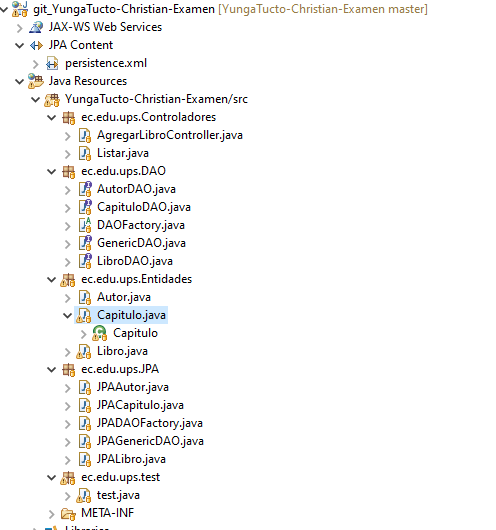
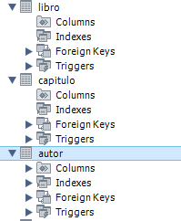
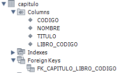
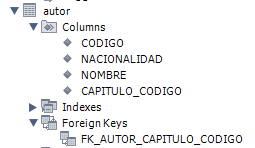

Nombre: Christian Yunga

Diseño del programa

Aquí se puede ver la estructura del proyecto dividido en paquetes y se esta
implementando el data acces object.

La base de datos resultante al ejecutar el programa es la siguiente

Dentro de cada tabla tenemos las siguientes columnas, con sus respectivas claves
foráneas

